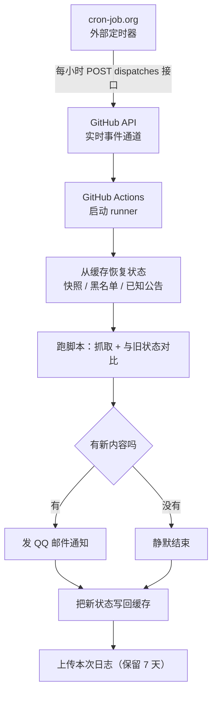

# 自动监控任务合集

一个用 **GitHub Actions** 跑定时任务的仓库。里面是三个互不相干的监控脚本，各自独立调度、独立通知。

> 仓库名还叫 `quark-share-monitor`（最初只为夸克那个任务建的），现在装了三个任务，名字已经不太准确了。

---

## 三个任务

| 任务 | 脚本 | 干什么 | 什么时候发邮件 |
|---|---|---|---|
| **夸克考研资料更新** | `quark_share_monitor.py` | 遍历指定分享目录树，对比快照找出新增 / 删除 / 改名 / 内容变化 | 有变化才发（邮件只汇总到老师 / 机构层级） |
| **B站热门拉黑** | `bili_block.py` | 扫热门榜，标题 / 推荐理由 / 标签命中关键词就拉黑对应 UP 主 | 本次真拉黑了人才发 |
| **南航研究生公告** | `nuaa_monitor.py` | 盯**两个栏目**：机电学院「研究生招生」+ 研究生院「硕士招生」，按文章 ID 判断新公告 | 有新公告才发（一封邮件按栏目分组） |

三个任务都遵守同一条原则：**没变化就完全静默，不打扰。**


---

## 整体流程



### 为什么不用 GitHub 自带的 `schedule`

GitHub Actions 自带 cron 触发，但这个仓库的实测结果是：**配置完全正确、workflow 状态 active、平台无故障，三个时间点却一个都没触发**。

原因有两个，而且都是 GitHub 平台侧的行为：

1. 新加入的 schedule workflow，GitHub 需要先"注册"，首次生效可能延迟数小时
2. GitHub 的 cron 调度器在高负载时会**直接丢弃**排队超时的任务（官方文档原话），而不是延后执行

所以改用外部定时器 `cron-job.org` 去调 GitHub 的 `workflow_dispatch` 接口 —— 这条路径走**实时事件通道**，秒级创建运行，绕开了那个不稳定的 cron 调度器。

三个 workflow 文件里的 `schedule` 触发**仍然保留**，作为兜底。重复触发不会造成重复邮件：脚本都是"有新内容才发"，而且状态持久化在缓存里，第二次跑会正确判定"无变化"。

---

## 状态是怎么跨轮保留的

GitHub Actions 每次跑都是一台**全新的机器**，跑完即销毁。所以"上一轮长什么样"必须存在外面：

```yaml
- uses: actions/cache/restore@v4   # 开跑前：把上一轮的状态取回来
  with:
    path: <状态目录>
    restore-keys: <前缀>-            # 前缀匹配 → 拿到最近一份
# ... 跑脚本、对比、生成新状态 ...
- uses: actions/cache/save@v4      # 跑完后：把新状态存回去
```

各任务的状态文件：

| 任务 | 状态文件 | 作用 |
|---|---|---|
| 夸克 | `quark_share_snapshot.json.gz` | 上次扫描的完整目录树快照 |
| B站 | `blacklist.json` | 已拉黑用户记录 |
| 南航 | `seen_announcements.json` | 已见过的公告文章 ID（每个源各自维护基线，见下） |

即使缓存被清空也不会误报：夸克会重建基线并提示"下次开始报告更新"，B站会自动从线上同步全部黑名单，南航会重新建立基线。

---

## 南航：两个栏目合并监控

`nuaa_monitor.py` 一次运行扫两个源，**合并成一封邮件**（按栏目分组）：

| key | 栏目 | 地址 |
|---|---|---|
| `cmee` | 机电学院「研究生招生」 | `https://cmee.nuaa.edu.cn/11462/list.htm` |
| `grad` | 研究生院「硕士招生」 | `https://www.graduate.nuaa.edu.cn/sszs/list.htm` |

两个值得注意的设计：

1. **按文章 ID 全集比对，不看位置**。机电学院那个栏目的第 1 条是**置顶**公告
   （《2027 年接收推荐免试研究生预报名通知》日期 07-21，却排 09-16 的公告前面），
   研究生院那边也有类似情况。用「列表第 1 条 / 最新日期」判新会漏检、误报；
   用文章 ID（`c11462a409933`、`c13487a410574`）做唯一键则完全不受排序和置顶影响。
   同一轮内若某条跨页重复出现（置顶项常见），按 ID 保序去重。
2. **每个源独立维护基线**。状态文件里记了 `initialized_sources`，
   新增一个源时该源会自动「静默建基线」——只记录当前已有公告、不发通知，
   所以往 `DEFAULT_CONFIG["sources"]` 里加一条不会让你被历史公告轰炸。
   旧版状态文件（没有这个字段）也能平滑升级：按条目 URL 反推哪些源已经建过基线。

单个源抓取失败（网络 / 结构变化）只跳过它自己，不影响另一个源；所有源都失败才跳过本轮。

要加第三个源（比如别的学院、博士招生、招生文件），只需在脚本顶上 `DEFAULT_CONFIG["sources"]`
追加一项 `{key, name, url, domain}`，提交即可 —— 首次运行会自动为它建基线。

---

## 夸克邮件的粒度：只到老师 / 机构

分享目录是按「学科 / 编号.老师或机构 / 课程 / 文件」组织的，比如
`2027 Svip政治 / 18.2027大牙 / 6-新思想带背第5课.mp4`。邮件**不列到具体文件**，
只汇总到老师 / 机构这一层：

```
涉及 7 个老师 / 机构，共 49 项变化

【新增】37 项，7 个老师 / 机构
  · 2027 Svip英语 / 06.2027高途【唐静】  16 项　最新 09-18 08:55
  · 2027 Svip政治 / 18.2027大牙          7 项（含 1 个新目录）　最新 09-18 08:46
  · 27考研PDF / 03.27政治PDF             5 项　最新 09-18 08:44

【内容变化】10 项，2 个老师 / 机构
  · 2027 Svip英语 / 06.2027高途【唐静】  9 项　最新 09-18 08:55
…
```

判断"老师 / 机构"这一层的规则：取路径里**最深的那个「编号 + 4 位年份」目录**（`18.2027大牙`、
`06.2027高途【唐静】`、`08.2027新东方【王江涛 易熙人】`、`13.2027 机械` 都算）。
注意**学科那一级也带同样的编号**（`01.2027 Svip政治`），所以取最深的一个才不会停错层；
课程级目录（`06.命题规律解析`、`17.【冲刺阶段-二轮刷题】`、`08.27考研…`）不带 4 位年份，不会误判。
PDF 区那种没有年份编号的（`03.27政治PDF / 27徐涛PDF`），退回上一级目录。

明细并没有丢 —— 完整的逐条列表（含文件名、大小、时间）仍然写进 `quark_share_updates.log`，
里面分了【摘要】和【明细】两段，要查具体是哪些文件去那里看。

想改回逐条列文件的旧格式：把 `quark_share_monitor.py` 里 `CONFIG['report_level']` 改成 `'detail'`，
或运行时加 `--report-level detail`。

---

## 目录结构

```
.
├── .github/workflows/
│   ├── monitor.yml          # 夸克：每小时第 7 分
│   ├── bili-block.yml       # B站：每小时第 23 分
│   └── nuaa-monitor.yml     # 南航：每小时第 41 分
├── quark_share_monitor.py   # 夸克分享更新监控
├── bili_block.py            # B站热门关键词拉黑
├── nuaa_monitor.py          # 南航招生公告监测（机电学院 + 研究生院 双源）
├── requirements.txt
└── .gitignore
```

三个任务错开分钟运行，避免同时打 GitHub API 和邮件服务器。

---

## 配置

### Secrets

在 `Settings → Secrets and variables → Actions` 里配置：

| Secret | 用途 |
|---|---|
| `QUARK_COOKIE` | 夸克网盘 cookie（导出格式：`a=1; b=2`） |
| `BILI_COOKIE` | B站完整 cookie，必须含 `SESSDATA`、`bili_jct`、`DedeUserID` |
| `SMTP_AUTH_CODE` | QQ 邮箱 SMTP 授权码（三个任务共用） |

脚本里所有敏感值都从环境变量读，**仓库代码里不含任何 cookie 或密码**。

### 外部定时器

在 [cron-job.org](https://cron-job.org) 建任务，每个都是 `POST` 到：

```
https://api.github.com/repos/Furina1027/quark-share-monitor/actions/workflows/<workflow>.yml/dispatches
```

请求头带 `Authorization: Bearer <GitHub token>`（fine-grained token，只需 `Actions: Read and write` 这一项权限、只勾本仓库），请求体是 `{"ref":"main"}`。

| 任务 | 触发时刻（北京时间） |
|---|---|
| 夸克 | 每小时第 7 分 |
| B站 | 每小时第 23 分 |
| 南航 | 每小时第 41 分 |

> 注意：cron-job.org 的免费版有「**连续失败 25 次自动停用任务**」的规则，所以 GitHub token 不要设太短的有效期，否则 token 一过期任务就会被自动停掉。
>
> 另外它的 REST API 有写入限流：**创建 job 每分钟最多 5 次**，超了返回 429（不是 500）。
> `extendedData.headers` 是**字典**不是数组，写错了会 500。

---

## 加一个新监控任务

1. 把脚本放进仓库根目录，所有敏感值改成读环境变量，状态文件路径也是
2. 在 `.github/workflows/` 加一个 yml，照着现有的改：换 `cron` 分钟、换缓存 key 前缀、换状态目录
3. 配好对应的 Secret
4. 在 cron-job.org 加一条任务，指向新的 workflow

---

## 本地运行

三个脚本都能脱离 GitHub Actions 单独跑：

```bash
python quark_share_monitor.py --once      # 夸克，扫一次
python bili_block.py                      # B站，扫一次
python nuaa_monitor.py --once             # 南航，检查一次
```

夸克脚本还支持 `--reset`（重建基线）、`--test-email`（测邮件）、`--list-watch`（检查监控目录是否还在）、
`--report-level source|detail`（报告粒度，默认 `source` = 只到老师/机构）。
南航脚本支持 `--init`（强制重建基线）、`--only grad`（只跑指定源，逗号分隔）、
`--test-parse`（离线解析本地 HTML）、`--url`（覆盖第一个源的地址）。

---

## 已知注意事项

- **cookie 会过期**。目前 cookie 失效时任务不会主动报警（拉黑/抓取失败后按"无变化"处理，静默跳过），需要自己留意。夸克脚本在鉴权失败时会发提醒邮件。
- **B站的 `bili_block.py` 每轮都会同步一次线上黑名单**（约 1200 人、20 秒），保证不会对已拉黑的人重复发请求。
- **南航的 `nuaa_monitor.py` 首次运行**（缓存为空）会自动用 `--init` 建基线，不会把历史公告当新公告轰炸。
  后来新增监测源同样不会：脚本会为这个新源单独静默建基线（见上文「南航：两个栏目合并监控」）。
- **公开仓库 60 天没有任何提交，GitHub 会自动禁用定时任务**。`monitor.yml` 里带了一个"月度保活"步骤，每 30 天自动提交一个 `.keepalive` 时间戳来避免这个问题。
  （即便真被禁用了也不影响 cron-job.org 那条路径 —— 它走的是 `workflow_dispatch`，不受这条规则约束。这也是外部调度的另一个好处。）
